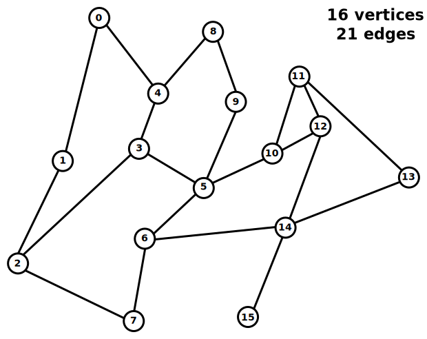

# Shortest Path Algorithms
This repository contains some code for algorithms that are used 
for finding the shortest path between two vertices in a graph.

The codes were written mainly to get some understanding on how those
algorithms work (and to get some coding practice in different language syntax)
and hence are *not* trimmed for efficiency.
E.g., graphs are saved as adjacency matrices, which is not very memory-efficient for
larger and sparse graphs.

## Graph Theory
Graph theory is a field of mathematics. The subject of study are the eponymous *graphs*.
In a general sense a graph **G** is an ordered pair *G = (V,E)* composing a set of *vertices* **V** and
a set of *edges* **E**. A vertex is sometimes also refered to as *node* or *point*.
An edge is an unordered pair of two vertices and is sometimes also refered to as *link* or *line*.
Each edge has a *weight* that can in some occasions be interpreted as the lenght of the edge.

<div align="left">

</div>

Graph representations can be used to handle many practical problems and are the foundation, e.g.,
for communication networks, flow of computation or data organization. 
In computer science high effort is devoted to the development of graph algorithms.

## Shortest path in graphs
The shortest path is the path between two vertices *u* and *v*, 
such that the sum of the weights of its constituent edges is minimized. 

This repository contains some examples for shortest path algorithms:

Algorithm | Description | source code
------------ | ------------- | -------------
Dijkstra's algorithm | single-source shortest path with non-negative weights | [Go](go/dijkstra.go), [Fortran](fortran/dijkstra.f90)
Bellman-Ford algorithm | single-source shortest path with arbitrary weights | [Go](go/bellman-ford.go)
Floyd-Warshall algorithm | all pairs shortest paths | [Go](go/floyd-warshall.go), [Fortran](fortran/floyd-warshall.f90)

Other algorithms or languages might be added later.

### Running the examples
Each of the source directories has a simple `Makefile`. 
To compile a binary `shortestpath` and execute it just use:

```bash
make
./shortestpath
```

Fortran uses the `gfortran` compiler, Go uses `go build`.
Other dependencies should not be needed.

Examples can be modified/added in the respective `main.*` source files.

